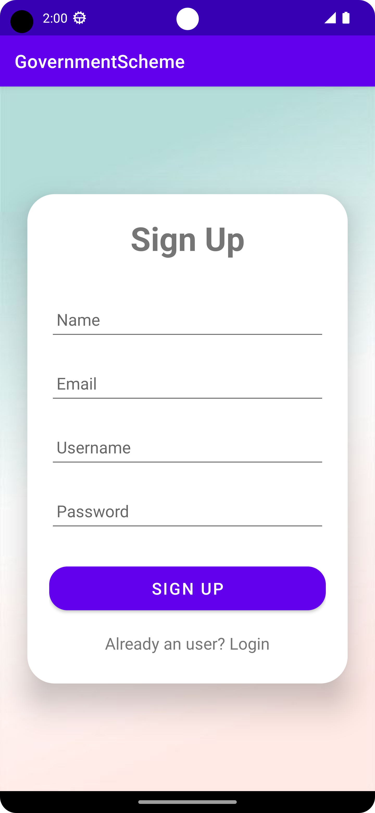
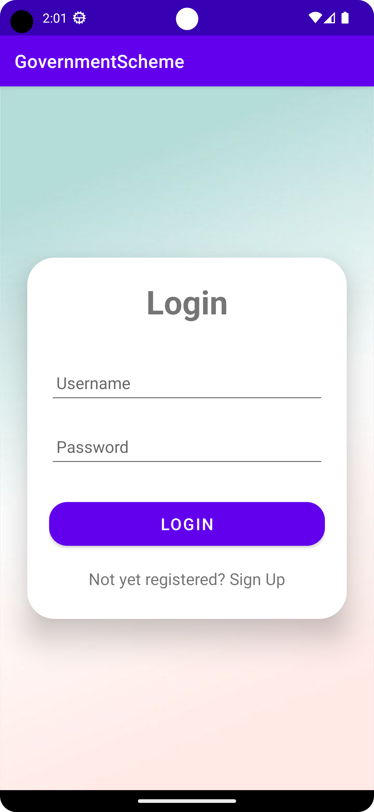
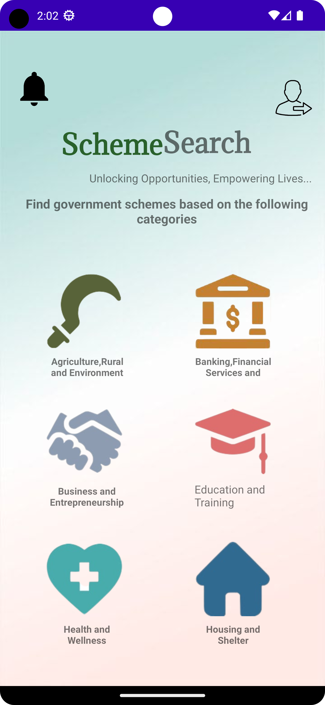
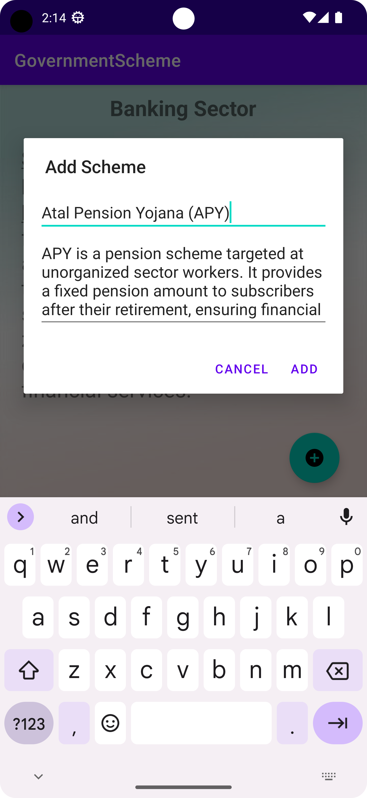
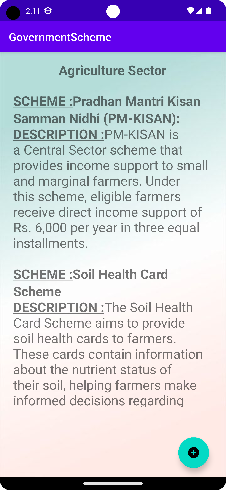
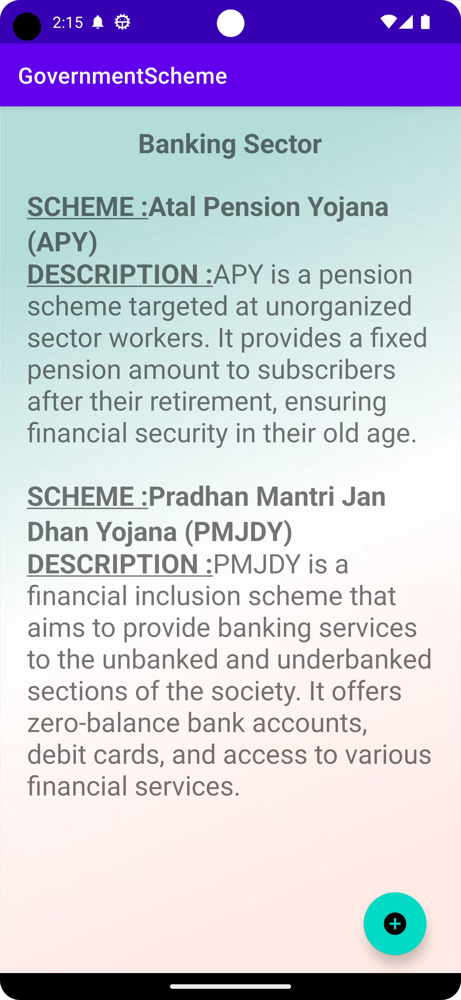
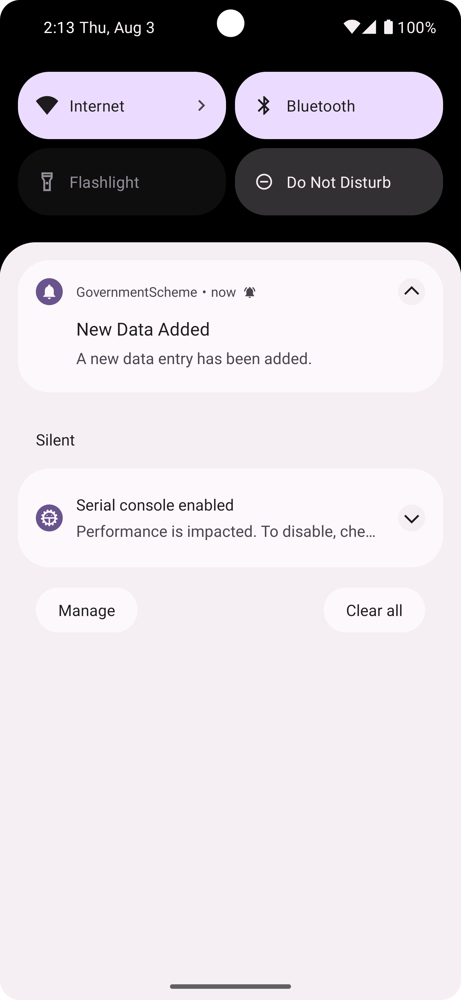

# GovernmentScheme

## Overview
Government Scheme Android App is an Android application that provides information about various government schemes categorized into different sectors such as Agriculture, Banking, Business, Education, Health, and Housing. Users can view details of different schemes, and administrators can manage the schemes through Firebase Firestore.

## Technologies Used
- Android Studio
- Java
- Firebase Firestore (Realtime Database)
- XML
- Git (Version Control)
- GitHub (Code Hosting)

## Features
1. **User Authentication**: Users can log in using their credentials to access the app features.
2. **Sector-wise Schemes**: Schemes are categorized into different sectors for easy navigation.
3. **Scheme Details**: Users can view detailed information about each scheme, including its description and benefits.
4. **Administrator Access**: Administrators can manage schemes by adding new schemes through the app.
5. **Push Notifications**: Users receive notifications about new schemes and updates.

## Screenshots

Enjoy exploring the Government Scheme Android App!
